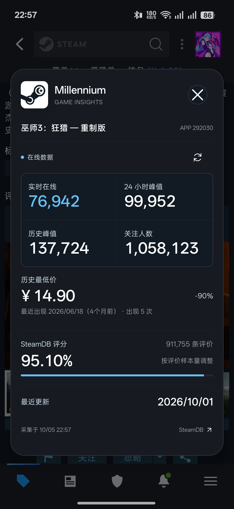

<a id="top"></a>

<div align="center">


<h1>Millennium</h1>

<p><strong>在 Steam 商店里，多看一层游戏信息。</strong></p>

<p>Android Steam 增强模块<br />在线人数 · 历史最低价 · SteamDB 评分 · 最近更新</p>

<p>
  
  
  
  
  <a href="https://github.com/Good-Joe2049/Millennium/blob/main/LICENSE"></a>
</p>

<p>
  <a href="https://github.com/Good-Joe2049/Millennium/releases"><strong>下载 APK</strong></a> ·
  <a href="#features">功能一览</a> ·
  <a href="#install">安装使用</a> ·
  <a href="#faq">常见问题</a> ·
  <a href="https://github.com/Good-Joe2049/Millennium/issues">问题反馈</a>
</p>

</div>

---

Millennium 为 Android 版 Steam 提供一个应用内悬浮面板。浏览游戏商店页面时，点击悬浮球，即可查看这款游戏的玩家活跃情况、价格记录、评分与更新日期，关闭后继续浏览。

项目使用 **现代 libxposed API 102**，将 SteamDB 与 Steam 的数据整合到原生 Android 界面中。各项数据功能独立组织，共用请求与缓存逻辑，方便后续扩展。

> [!NOTE]
> 项目正在开发中。本文描述当前源码已接入的功能，具体兼容情况取决于 Steam 版本、框架和页面结构。源码还包含 Steam Guard 本地导出实验逻辑，使用前请阅读[当前开发状态](#status)。

<a id="features"></a>

## ✨ 功能一览

<a href="./docs/images/panel-witcher3.jpg"></a>

| 功能 | 可以查看或完成什么 |
| :--- | :--- |
| **悬浮面板** | 点击展开、拖动悬浮球、记住位置 |
| **在线数据** | 实时在线人数、24 小时峰值人数、历史峰值人数、关注数 |
| **历史最低价** | 历史最低价格、折扣或活动说明、出现次数、最近出现日期 |
| **SteamDB 评分** | 按 SteamDB 算法计算的评分，以及参与计算的评价总数 |
| **最近更新** | SteamDB 记录的游戏更新日期，以及距今天数 |

### 📊 看活跃情况

把当前在线、近期峰值和历史峰值放在一起，了解游戏当前的活跃程度。实时在线人数优先使用 Steam 官方接口；该请求不可用时，使用 SteamDB 返回的记录。

### 💰 看价格记录

历史最低价跟随当前商店页面识别到的**币种和定价地区**，同时展示折扣、出现次数和最近出现时间。已识别为免费的游戏会跳过史低查询；无法确定币种或地区时，面板会说明原因。

### ⭐ 看评价表现

从当前 Steam 商店页面读取好评数和差评数，再按 SteamDB 的评分公式计算。这个分数会考虑评价样本量，因此可能与 Steam 直接展示的好评百分比不同。

### 🗓️ 看更新日期

更新日期与在线数据共用一次 SteamDB 游戏信息查询。这里显示的是 SteamDB 返回的游戏更新日期，不是发售日期或模块最近查询的时间。

<br clear="both" />

<a id="install"></a>

## 🚀 安装与开始使用

### 环境要求

| 项目 | 要求 |
| :--- | :--- |
| Android | 项目声明最低 **Android 8.0 / API 26**；实际运行还需满足所用框架的要求 |
| 架构 | **arm64-v8a**；当前构建仅包含这一架构的原生库 |
| Xposed 环境 | 已正常工作的、支持 **libxposed API 102** 的 LSPosed 或兼容框架 |
| 目标应用 | Android 版 Steam：`com.valvesoftware.android.steam.community` |
| 网络 | 能访问 Steam 与 SteamDB 的数据服务 |

> [!IMPORTANT]
> 请确认**框架核心支持 API 102**。仅安装 LSPosed 管理器，或仅支持旧版 Xposed API 的环境，不能满足本模块的加载要求。

### 安装步骤

1. 从 [GitHub Releases](https://github.com/Good-Joe2049/Millennium/releases) 下载并安装模块 APK。若暂未提供发布包，可按[源码构建](#development)自行生成。
2. 在 LSPosed 或兼容框架的管理器中启用 **Millennium**。
3. 在模块作用域中勾选 **Steam**，对应包名为 `com.valvesoftware.android.steam.community`。
4. **强制停止 Steam，再重新打开**，让框架加载模块。
5. 在 Steam 内打开某款游戏的商店详情页。
6. 点击悬浮球，等待面板显示该游戏的数据。

### 日常使用

- **查看信息**：进入游戏商店详情页后，点击悬浮球打开面板。
- **调整位置**：拖动悬浮球，将入口放到顺手的位置。
- **收起面板**：点击“关闭”或面板外的遮罩区域。
- **切换游戏**：进入另一款游戏的商店页后再查看面板，模块会按当前游戏查询，并忽略已失效页面的请求结果。

悬浮球附着在 Steam 的应用窗口中，当前实现不需要申请 Android 的“显示在其他应用上层”权限。

<a id="data"></a>

## 🔎 数据来源与刷新方式

| 显示内容 | 数据来源 | 处理方式 |
| :--- | :--- | :--- |
| 实时在线人数 | Steam 官方接口；SteamDB 作为后备 | 优先显示 Steam 的结果，请求失败时使用 SteamDB 的 `cp` |
| 24 小时峰值、历史峰值、关注数 | SteamDB 游戏信息接口 | 分别读取 `mdp`、`mp`、`f` |
| 最近更新日期 | 同一份 SteamDB 游戏信息 | 读取 `u`，转换为日期及相对天数 |
| 历史最低价 | SteamDB 价格接口 | 按游戏 AppID 与币种／定价地区查询 |
| SteamDB 评分 | Steam 商店页面中的评价数据 | 在本地计算，不额外请求 SteamDB |

打开面板或已观察到的游戏页面发生变化时，模块会获取所需数据，并短期复用成功结果。当前进程内，Steam 实时人数缓存 **30 秒**、SteamDB 游戏信息缓存 **60 秒**、史低价格缓存 **5 分钟**。缓存有效期不是后台轮询周期，面板不会持续推送每秒变化的人数。

同一个查询正在进行时会合并等待，避免重复请求。不同数据请求分别处理结果，单项数据不可用时会显示提示；缺失字段用 `—` 表示。

<details>
<summary><strong>技术细节：共用的请求方式</strong></summary>

公共请求层优先使用 **Cronet**，初始化或网络传输失败时回退到 **HttpURLConnection**，两种传输共用同一套请求头生成逻辑。SteamDB 与 Steam 官方接口使用各自对应的请求头。

HTTP 错误响应不会因为切换传输而自动重试。SteamDB 返回 `429` 时，模块会参考 `Retry-After` 暂停后续 SteamDB 查询。

游戏信息与更新日期共用 `ExtensionApp`；史低使用 `ExtensionAppPrice`。这些接口的行为和可用性由上游服务决定，并非本项目提供的稳定性承诺。

</details>

<a id="faq"></a>

## 💬 常见问题

<details>
<summary><strong>安装后为什么没有悬浮球？</strong></summary>

先确认模块已启用、作用域已选择 Steam、框架核心支持 API 102，然后强制停止并重新打开 Steam。若仍未出现，请提供模块加载阶段的 LSPosed 日志。

自行构建 release 时，还需保留项目的 `proguard-rules.pro` 并在 Gradle 中引用它。`META-INF/xposed/java_init.list` 声明入口，并不会自动阻止 R8 删除入口类。

</details>

<details>
<summary><strong>为什么提示“当前不是 Steam 游戏商店页面”？</strong></summary>

目前按 Steam 内 WebView 的游戏商店 URL 识别 AppID，例如 `https://store.steampowered.com/app/1623730/`。请进入具体游戏的商店详情页；首页、搜索结果、社区页或购买包页面不一定包含可用于本功能的游戏 AppID。

</details>

<details>
<summary><strong>为什么在线人数正常，其他数据却不可用？</strong></summary>

实时在线人数可以由 Steam 官方接口单独返回，而峰值、关注数、史低和更新日期依赖 SteamDB。两者可能出现不同的网络或服务状态。请查看日志中的 `source`、`status` 和错误类型，区分传输失败、接口拒绝与字段缺失。

</details>

<details>
<summary><strong>为什么史低价格与其他地区看到的不一样？</strong></summary>

价格查询跟随商店页面的币种和定价地区，不按手机语言判断。部分美元定价地区拥有不同的价格记录，不能只按货币符号比较。短期缓存和上游更新时间也可能造成差异。

</details>

<details>
<summary><strong>为什么评分与 Steam 的好评率不同，或评分没有显示？</strong></summary>

SteamDB 评分包含基于评价总量的调整，并非简单的“好评数 ÷ 总评价数”。当前功能需要读取商店页面提供的评价统计；页面尚未完成加载、未提供对应字段或结构发生变化时，会提示未读取到数据。

</details>

<details>
<summary><strong>可以在没有 Root 或只有旧版 Xposed 的环境中使用吗？</strong></summary>

当前按支持 libxposed API 102 的框架环境开发与接入，尚未提供经过验证的免 Root 安装方案。不能仅凭其他模块支持 LSPatch／NPatch，就认定本模块也兼容。

</details>

<details>
<summary><strong>支持哪些 Steam 版本？</strong></summary>

目前尚未建立完整的 Steam 版本兼容矩阵。宿主界面与 WebView 页面更新可能影响模块入口或数据读取。反馈时请附上 Steam 的版本号、版本代码及安装来源，方便复现。

</details>

<a id="status"></a>

## 🧪 当前开发状态

商店数据面板是当前主要功能。源码中同时保留了 **Steam Guard 本地导出实验逻辑**和宿主运行诊断代码：

- 模块会挂钩 Steam 的部分安全存储读取路径；命中相关逻辑后，会尝试将读取到的数据写入系统剪贴板，并显示 `SteamGuard data copied` 提示。
- 这段逻辑位于 `ModuleMain.kt`，目前没有独立的面板开关，也不是由 SteamDB 查询按钮触发。
- 导出数据可能包含验证器密钥。请勿将这类剪贴板内容、二维码或完整导出数据提交到公开 Issue、截图或日志附件中。

SteamDB 面板的数据请求与上述导出逻辑分开。问题反馈优先截取下方列出的 `steamdb` 日志，避免附带无关账号信息。

<a id="development"></a>

## 🛠️ 从源码构建

```bash
git clone https://github.com/Good-Joe2049/Millennium.git
cd Millennium
```

| 工具 | 当前配置 |
| :--- | :--- |
| Android SDK | `compileSdk = 37`、`targetSdk = 37` |
| Gradle | 使用仓库自带 Wrapper，当前为 `9.5.0` |
| Android Gradle Plugin | `9.3.3` |
| Gradle Daemon JDK | 仓库工具链配置为 **JDK 25** |
| Java 编译级别 | 源码与目标级别为 **17**，与 Gradle 运行 JDK 的要求不同 |
| 模块 API | `io.github.libxposed:api:102.0.0`，以 `compileOnly` 方式依赖 |

在 Android Studio 中配置 Android SDK 与 Gradle JDK，完成依赖同步。具体版本以仓库里的 Gradle 配置为准。

<details>
<summary><strong>Windows / PowerShell</strong></summary>

```powershell
# 生成可直接安装测试的 Debug APK
.\gradlew.bat :app:assembleDebug

# 运行单元测试和 Lint
.\gradlew.bat :app:testDebugUnitTest :app:lintDebug

# 生成开启 R8 与资源缩减的 Release APK
.\gradlew.bat :app:assembleRelease
```

</details>

<details>
<summary><strong>Linux / macOS</strong></summary>

```bash
chmod +x gradlew
./gradlew :app:assembleDebug
./gradlew :app:testDebugUnitTest :app:lintDebug
./gradlew :app:assembleRelease
```

</details>

Debug APK 输出到 `app/build/outputs/apk/debug/`，Release APK 输出到 `app/build/outputs/apk/release/`。未配置 release 签名时，生成的是未签名 APK，需要签名后才能安装；也可以使用 Android Studio 的 **Generate Signed App Bundle or APK → APK**。

Release 已开启 R8 和资源缩减，并通过 `app/proguard-rules.pro` 保留现代 Xposed 入口。当前只打包 `arm64-v8a` 原生库。后续更新应沿用同一份签名；签名密钥、密码、本机 SDK 路径和构建产物不应提交到仓库。

<details>
<summary><strong>项目结构与功能扩展方式</strong></summary>

```text
app/src/main/
├── java/com/millennium/app/
│   ├── ModuleMain.kt                  # 现代 Xposed 入口与宿主 Hook
│   ├── core/                         # 宿主运行诊断
│   └── features/
│       ├── ui/                       # 悬浮球、面板与界面观察
│       └── steamdb/
│           ├── SteamDbPanelController.kt
│           ├── SteamDbOnlineStatsFeature.kt
│           ├── network/              # Cronet、回退、请求头与错误日志
│           ├── data/                 # 接口解析、缓存、请求合并与页面取数
│           ├── ui/                   # 公共数据区块布局
│           ├── lowestprice/          # 历史最低价
│           ├── rating/               # SteamDB 评分
│           └── lastupdate/           # 最近更新日期
├── res/                              # 图标、字符串与界面资源
└── resources/META-INF/xposed/
    ├── java_init.list                # Java 入口类声明
    ├── module.prop                   # API 要求与模块配置
    └── scope.list                    # 推荐作用域
```

新增数据功能时，优先复用 `network` 公共请求层和 `data` 数据层，在独立功能目录中编写展示逻辑。对同一接口已有的字段进行扩展时，复用现有请求，避免为每个面板区块创建新的网络引擎。

</details>

<a id="feedback"></a>

## 🤝 反馈与贡献

欢迎通过 [Issues](https://github.com/Good-Joe2049/Millennium/issues) 报告问题、提出功能建议，或通过 [Pull Requests](https://github.com/Good-Joe2049/Millennium/pulls) 贡献改进。

提交问题时，请提供：

- **环境**：设备型号、Android 版本、框架名称与核心版本。
- **版本**：Millennium 版本、Steam 版本号／版本代码及安装来源。
- **页面**：出现问题的游戏商店链接或 AppID。
- **现象**：复现步骤、预期表现、实际表现，以及必要的截图或录屏。
- **日志**：同一次操作中的相关日志，上传前去除账号信息与验证器数据。

<details>
<summary><strong>日志筛选参考</strong></summary>

在 Android Studio Logcat 中，选择 Steam 进程，并按消息筛选：

```text
message:steamdb
```

| 关键词 | 用途 |
| :--- | :--- |
| `steamdb page detected` | 是否识别到当前游戏 AppID |
| `steamdb page metadata` | 币种、定价地区与评价字段的读取情况 |
| `steamdb network cronet` | Cronet 初始化和网络回退情况 |
| `steamdb network http response` | 数据来源、传输方式、HTTP 状态码和耗时 |
| `steamdb network interface rejected` | 服务端返回非成功 HTTP 状态 |
| `steamdb feature failed` | 具体功能的失败结果 |

SteamDB 游戏信息可筛选 `message:source=steamdb`，价格接口可进一步筛选 `message:source=steamdb-price`，实时在线人数对应 `message:source=steam-current-players`。

若悬浮球完全没有出现，请额外查看 `MillenniumXposed`、`settings demo` 和 LSPosed 模块加载日志；仅有 `steamdb` 日志不足以判断入口是否加载。

</details>

修改数据逻辑时，请验证缺失字段、接口失败和切换游戏的情况；修改悬浮界面时，请附上展开、收起与拖动的实机验证结果。涉及入口或反射调用的改动，也应验证开启 R8 的 release 构建。

<a id="credits"></a>

## 🙏 致谢

| 项目 | 用途或参考 |
| :--- | :--- |
| [SteamDB Browser Extension](https://github.com/SteamDatabase/BrowserExtension) | 游戏数据字段、价格地区处理与评分算法参考 |
| [libxposed API](https://central.sonatype.com/artifact/io.github.libxposed/api/102.0.0) | 现代 Xposed 模块 API |
| [Chromium / Cronet](https://developer.android.com/develop/connectivity/cronet) | 原生网络请求能力 |
| [AndroidX](https://developer.android.com/jetpack/androidx) | Android 应用与界面基础组件 |

<a id="license"></a>

## 📄 许可证

本项目采用 **[MIT License](https://github.com/Good-Joe2049/Millennium/blob/main/LICENSE)**，版权信息与完整授权条款见许可证文件。第三方代码、依赖和资源仍分别遵循其原始许可证。

Millennium 是独立开发的社区项目，与 Valve、Steam 或 SteamDB 无官方隶属或合作关系。相关名称与商标归各自权利人所有。

---

<div align="center">

<p><strong>喜欢这个项目的话，欢迎点亮一颗 Star。</strong><br />清晰的反馈和可复现的问题，同样能帮助 Millennium 持续改进。</p>

<p><a href="https://github.com/Good-Joe2049/Millennium">GitHub</a> · <a href="https://github.com/Good-Joe2049/Millennium/releases">Releases</a> · <a href="https://github.com/Good-Joe2049/Millennium/issues">Issues</a> · <a href="#top">返回顶部 ↑</a></p>

</div>
